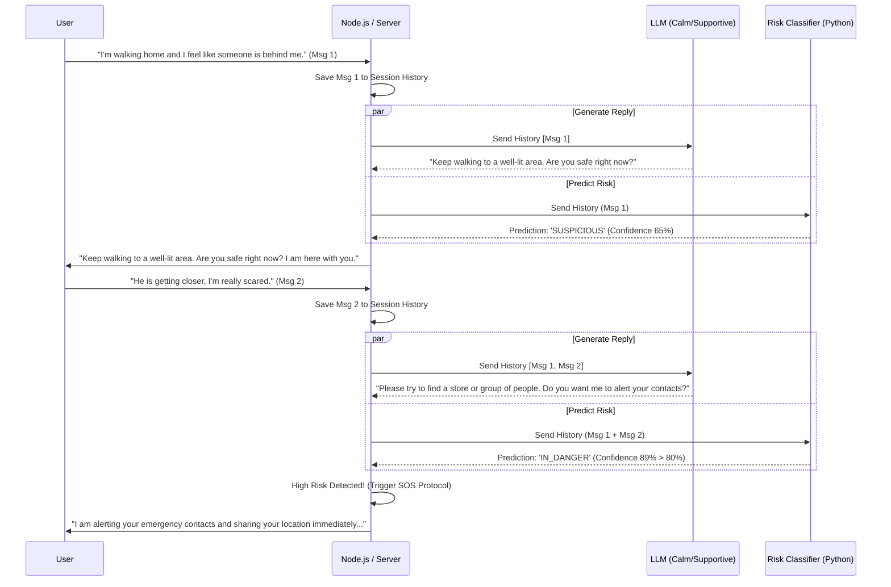

# Conversational Classification Architecture (Women's Safety Context)

In a women's safety application where the user might be distressed or in trouble, relying on a single message to classify their state can be inaccurate or jarring. By separating the **conversational flow** from the **classification task**, you can provide a calming, supportive chat experience while your ML model continuously evaluates the risk level in the background.

Here is the recommended architecture for a distress-detection chatbot.

## The Architecture
You will need three main components working together:
1. **The Context Manager (Backend)**: Stores the text history of the conversation for the ongoing session.
2. **The Supportive Agent (Chatbot/LLM)**: Handles the "regular talk". It is prompted to be calm, empathetic, and resource-gathering. It takes the conversation history and generates the next reply.
3. **The Risk Classification Model**: Your ML model. Instead of acting on just the latest message, it takes the **concatenated history** of the last $N$ messages. It uses a **Confidence Threshold** to trigger emergency protocols.



---

## 1. Updating your ML Model (Python)
In a safety context, your classification model must output **probabilities** rather than just a hard label. You might also want **different thresholds for different classes**. For example, you should be quicker to trigger an `IN_DANGER` alert (lower threshold) to be safe, while requiring higher confidence to mark a user as `SAFE`.

```python
# ml_api.py (FastAPI / Flask example)
from fastapi import FastAPI
import torch

app = FastAPI()

# Emergency thresholds
DANGER_THRESHOLD = 0.75 
DISTRESSED_THRESHOLD = 0.85

@app.post("/predict")
async def predict_risk_level(data: dict):
    # 'text' is the accumulated conversation history
    conversation_history = data.get("text", "")
    
    # 1. Tokenize the accumulated text
    inputs = tokenizer(conversation_history, return_tensors="pt", truncation=True, max_length=512)
    
    # 2. Get Model Output
    with torch.no_grad():
        outputs = model(**inputs)
        logits = outputs.logits
        
    # 3. Apply Softmax to get confidence percentages (0.0 to 1.0)
    probabilities = torch.nn.functional.softmax(logits, dim=-1)
    max_prob, predicted_class_idx = torch.max(probabilities, dim=1)
    
    confidence = max_prob.item()
    predicted_risk = model.config.id2label[predicted_class_idx.item()] # e.g., 'IN_DANGER', 'DISTRESSED', 'SAFE'
    
    # 4. Check if the model has crossed the safety thresholds
    prediction_made = False
    
    if predicted_risk == 'IN_DANGER' and confidence >= DANGER_THRESHOLD:
        prediction_made = True
    elif predicted_risk == 'DISTRESSED' and confidence >= DISTRESSED_THRESHOLD:
        prediction_made = True
        
    return {
        "prediction_made": prediction_made,
        "risk_level": predicted_risk if prediction_made else "EVALUATING",
        "confidence": confidence
    }
```

---

## 2. Setting up the Backend Logic (Node.js)
Your backend must act as the orchestrator. Safety is paramount here; if the backend detects that the ML model is confident the user is in danger, it overrides the normal conversational flow and triggers the emergency SOS protocols.

```javascript
// index.js (Node.js Backend handling the logic)
const express = require('express');
const app = express();
app.use(express.json());

// In-memory store for user sessions
const sessions = {}; 

// System prompt to force the LLM to behave appropriately
const SYSTEM_PROMPT = `You are a women's safety AI assistant. 
Your goal is to be calming, supportive, and to help the user navigate to safety. 
Ask brief, clear questions to assess their surroundings. Do not panic.`;

app.post('/chat', async (req, res) => {
    const { userId, message } = req.body;

    // 1. Initialize session history
    if (!sessions[userId]) {
        sessions[userId] = { history: [], status: 'ACTIVE' };
    }
    
    sessions[userId].history.push(`User: ${message}`);

    // If already in SOS mode, bypass normal chat
    if (sessions[userId].status === 'SOS_TRIGGERED') {
        return res.json({ 
            reply: "Emergency protocols are active. Help is on the way. Please stay on the line.",
            sosActive: true
        });
    }

    // 2. Extract recent context for the ML Model (Sliding Window)
    // We send the last 3-4 messages so the model understands the accumulating panic/distress.
    const recentHistory = sessions[userId].history.slice(-4).join(" | ");

    // 3. Ask your Python ML model for a risk assessment
    const mlResponse = await fetch('http://localhost:8000/predict', {
        method: 'POST',
        headers: { 'Content-Type': 'application/json' },
        body: JSON.stringify({ text: recentHistory })
    }).then(res => res.json());

    // 4. Generate the comforting/supportive reply from the LLM
    const llmReply = await generateConversationalReply(SYSTEM_PROMPT, sessions[userId].history);
    sessions[userId].history.push(`Bot: ${llmReply}`);

    // 5. Evaluate Risk Level
    if (mlResponse.prediction_made && mlResponse.risk_level === 'IN_DANGER') {
        // High risk identified!
        sessions[userId].status = 'SOS_TRIGGERED';
        
        // TODO: Call your emergency API to alert contacts / track location
        await triggerEmergencyContacts(userId);
        
        return res.json({
            reply: "I am detecting that you are in immediate danger. I have alerted your emergency contacts with your live location. " + llmReply,
            sosActive: true,
            riskLevel: 'IN_DANGER'
        });
    } else if (mlResponse.prediction_made && mlResponse.risk_level === 'DISTRESSED') {
        // User is distressed but not necessarily requiring immediate automated SOS
        // The LLM will continue talking to them, but you can flag this in your UI
        return res.json({
            reply: llmReply,
            sosActive: false,
            riskLevel: 'DISTRESSED'
        });
    } else {
        // Still evaluating or user is deemed safe
        return res.json({
            reply: llmReply,
            sosActive: false,
            riskLevel: 'EVALUATING'
        });
    }
});
```

### Key Considerations for a Safety App:
1. **Asymmetric Thresholds:** As shown in the Python code, the threshold required to trigger an `IN_DANGER` state should be lower than the threshold required to label someone `SAFE`. False positives are better than false negatives in safety contexts.
2. **System Prompts for LLMs:** If you use an LLM for the conversational piece, prompt it aggressively to act like a 911 dispatcher—calm, collected, asking short questions like "Where are you?" rather than giving long-winded AI responses.
3. **Graceful Interruptions:** When the ML model suddenly decides the user is in danger, the app should seamlessly interrupt the normal chat flow to notify the user that automated help is being arranged, so they don't feel like they are "just talking to a bot."
